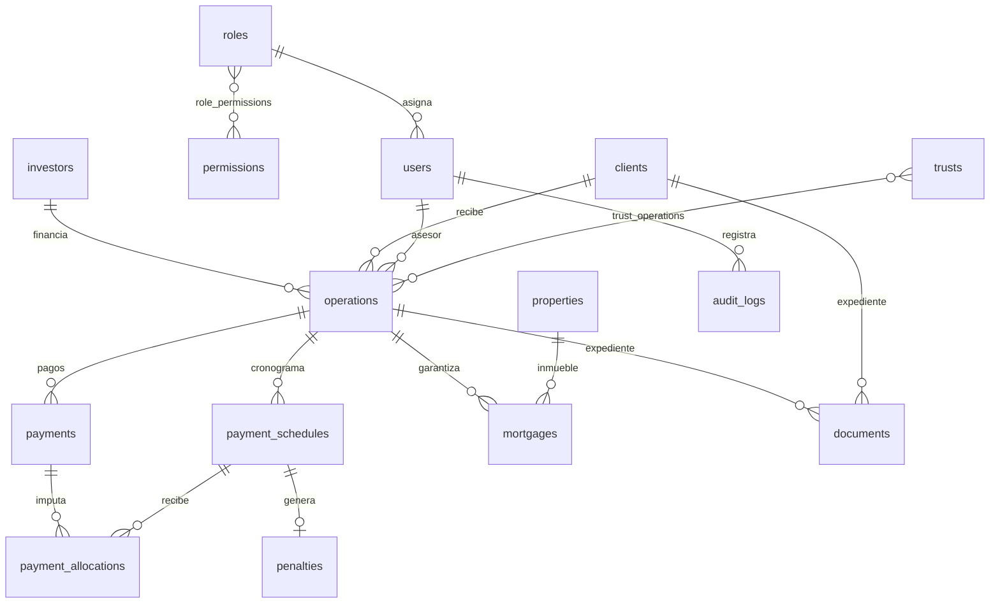

# CAPEX Gestión

Sistema web para gestionar bonistas, clientes y operaciones con **garantía hipotecaria en fideicomiso**: capital, intereses, cronogramas, pagos, penalidades, garantías, fideicomisos, documentos, reportes y auditoría.

- **Backend:** Django 5.2 (Python 3.12+)
- **Base de datos:** PostgreSQL en producción; SQLite solo para desarrollo. Se cambia con `DATABASE_URL`.
- **Frontend:** plantillas Django con CSS propio y Chart.js servido localmente. No requiere build de Node.
- **Exportación:** Excel (openpyxl) y PDF (reportlab).

## Puesta en marcha (desarrollo)

```bash
python -m venv .venv && source .venv/bin/activate
pip install -r requirements.txt
export DJANGO_DEBUG=1                      # usa SQLite y una clave de desarrollo
python manage.py migrate
python manage.py inicializar --correo admin@empresa.pe --clave 'UnaClaveLarga-2026'
python manage.py cargar_demo --clave 'Demo-Capex-2026'   # opcional: datos FICTICIOS
python manage.py runserver
```

Abra http://127.0.0.1:8000. Con la demo cargada existe un usuario por rol (`gerencia`, `finanzas`, `cobranzas`, `asesor`, `consulta`), todos con la clave que se pasó en `--clave`.

## Producción

1. Cree la base PostgreSQL y copie `.env.example` como variables de entorno. Llene `DJANGO_SECRET_KEY`, `DATABASE_URL`, `DJANGO_ALLOWED_HOSTS`, `MEDIA_ROOT` y los datos SMTP.
2. Ejecute `python manage.py migrate`, luego `python manage.py inicializar` (usa `ADMIN_EMAIL` y `ADMIN_PASSWORD`) y finalmente `python manage.py collectstatic`.
3. Arranque con `gunicorn config.wsgi` detrás de HTTPS. Con `DJANGO_DEBUG=0` se activan cookies seguras, HSTS y la redirección a HTTPS.
4. Programe a diario el comando `python manage.py actualizar_cartera` (cron, por ejemplo a las 00:05). Recalcula penalidades, estados y saldos. Además, el dashboard recalcula la cartera una vez al día si el cron no corrió.
5. Respalde la base de datos y la carpeta `MEDIA_ROOT`, donde se guardan los documentos. Esa carpeta nunca se publica: los archivos se descargan por una vista que verifica permisos.

El `Procfile` sirve para Railway o Heroku.

## Módulos

| Módulo | Qué hace |
|---|---|
| Acceso | Login con usuario o correo y contraseña hasheada (PBKDF2-SHA256). Bloqueo temporal tras varios intentos fallidos. Recuperación por correo, cierre de sesión por inactividad, cambio obligatorio de contraseña temporal y cierre forzado de sesiones por el administrador. |
| Roles y permisos | 6 roles base: ADMINISTRADOR, GERENCIA, FINANZAS, COBRANZAS, ASESOR y CONSULTA. Matriz editable con 26 permisos. Un ASESOR solo ve sus clientes y operaciones asignadas. |
| Dashboard | Indicadores por moneda (PEN o USD), conteo de operaciones por estado con semáforo y 6 gráficos mensuales: colocación, intereses, recuperaciones, morosidad, penalidades y flujo de caja real más 6 meses proyectados. También muestra las alertas y los próximos vencimientos. |
| Bonistas / Clientes | Fichas completas con expediente digital. Un bonista puede tener varias operaciones. |
| Operaciones | Código automático `OP-AAAA-NNNNN`. La fórmula y el cronograma se muestran antes de registrar. Las condiciones económicas no se pueden editar si ya hay pagos; en ese caso se usa **Reestructurar**, que cierra la original como REESTRUCTURADA y crea una nueva con el saldo. |
| Pagos | REGISTRAR PAGO con imputación automática o manual (capital, interés, penalidad) y simulación previa. Permite pagos parciales y cancelación anticipada (capital + interés devengado + penalidad). Los pagos no se borran: se **ANULAN** y el registro se conserva. |
| Penalidades | Fija, porcentual, % diario, monto diario o tasa moratoria, con días de tolerancia. Muestra la fórmula aplicada. La condonación queda en auditoría y nunca se borra el monto calculado. |
| Garantía | Inmueble, partida SUNARP, valores comercial y de realización, rango e inscripción. Calcula el LTV y alerta si supera el límite. |
| Fideicomiso | Datos del fideicomiso vinculado a una o varias operaciones. |
| Estado de cuenta | Vista imprimible, descarga en PDF y exportación a Excel. |
| Reportes | 11 reportes con filtros, exportables a Excel y PDF. |
| Documentos | DNI, contrato, tasación, copia literal, SUNARP, contrato de fideicomiso, vouchers y otros. Valida formato y tamaño. Los documentos se anulan, no se borran. |
| Auditoría | Bitácora inmutable: usuario, fecha, hora, acción, módulo, registro, valor anterior, valor nuevo e IP. Exportable a Excel. |
| Configuración | Empresa, logo, moneda, tipo de cambio, límite de LTV, días de alerta, días para pasar a mora, vigencia de tasación, orden de imputación, documentos obligatorios y perfiles de condiciones (tipos de tasa y penalidad). |

## Motor de cálculo (`core/services/engine.py`)

No hay una fórmula fija. Cada operación guarda su propia copia de los parámetros:

- **Tipo de tasa:** TEA, TNA, TEM o TNM.
- **Método:** interés simple o compuesto.
- **Base de días:** 360 o 365. **Conteo:** días reales (ACT) o periodo estándar de 30 días.
- **Periodicidad:** mensual a anual, o pago único. **Amortización:** bullet, francés o alemán. **Gracia:** parcial o total.
- **Penalidad:** tipo, valor, base (cuota, capital o interés vencido) y tolerancia.

Fórmulas:

- **Interés simple:** `i(d) = j × d / base`, donde `j` es la tasa anual lineal (TNM × 12 o TNA).
- **Interés compuesto:** `i(d) = (1 + TEA)^(d/base) − 1`. Si la tasa es nominal, primero se convierte a TEA con m capitalizaciones.
- **Interés devengado al corte:** interés de las cuotas vencidas + interés de la cuota en curso × días transcurridos / días del periodo.
- **Penalidad diaria:** se calcula día por día sobre el saldo vencido impago, de modo que los pagos parciales la reducen.
- **LTV** = capital / valor comercial de la garantía × 100.

Cambiar la configuración o un perfil **no modifica** operaciones ya registradas.

El perfil inicial "Titulización bullet · TNM ACT/360" replica la estructura del contrato de fideicomiso de titulización: intereses mensuales, capital al vencimiento y base ACT/360. Su tasa moratoria queda en 0 hasta que la empresa defina la vigente.

## Base de datos

Tablas: `users`, `roles`, `permissions`, `role_permissions`, `investors`, `clients`, `operations`, `payment_schedules`, `payments`, `payment_allocations`, `penalties`, `properties`, `mortgages`, `trusts`, `trust_operations`, `documents`, `audit_logs`, `system_settings`, `financial_profiles`.



Reglas de integridad:

- Todas las relaciones usan `PROTECT`.
- Pagos, imputaciones, penalidades, documentos y auditoría bloquean su borrado físico.
- El cronograma se versiona: un cambio de condiciones antes de cualquier pago crea una versión nueva y conserva la anterior.

## Pruebas

```bash
DJANGO_DEBUG=1 python manage.py test core
```

Son 26 pruebas: motor financiero, flujo de login y bloqueo, permisos por rol, alcance del asesor, alta con vista previa, pago, simulación, anulación, cancelación anticipada, condonación, exportaciones e inmutabilidad de la auditoría. Pasan en SQLite y en PostgreSQL 16.
